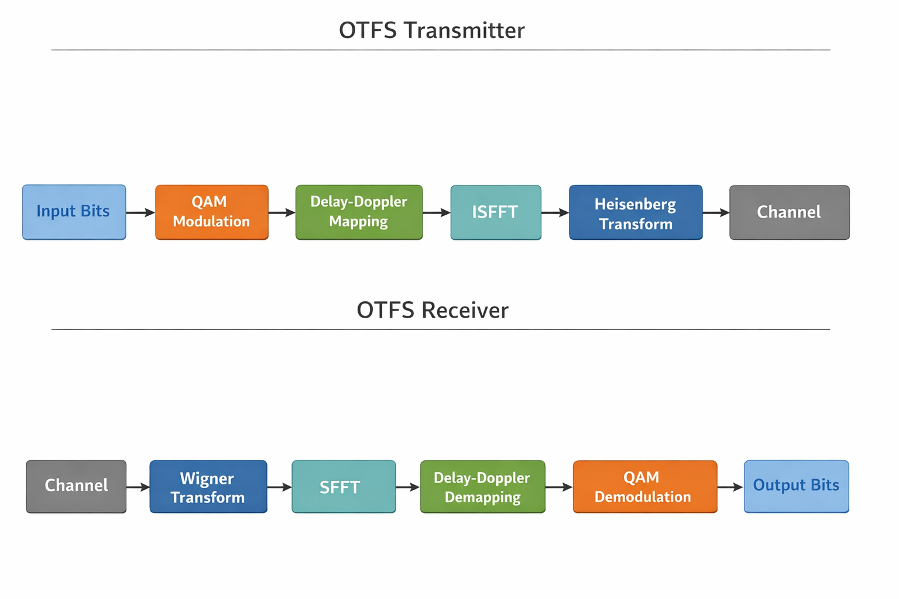
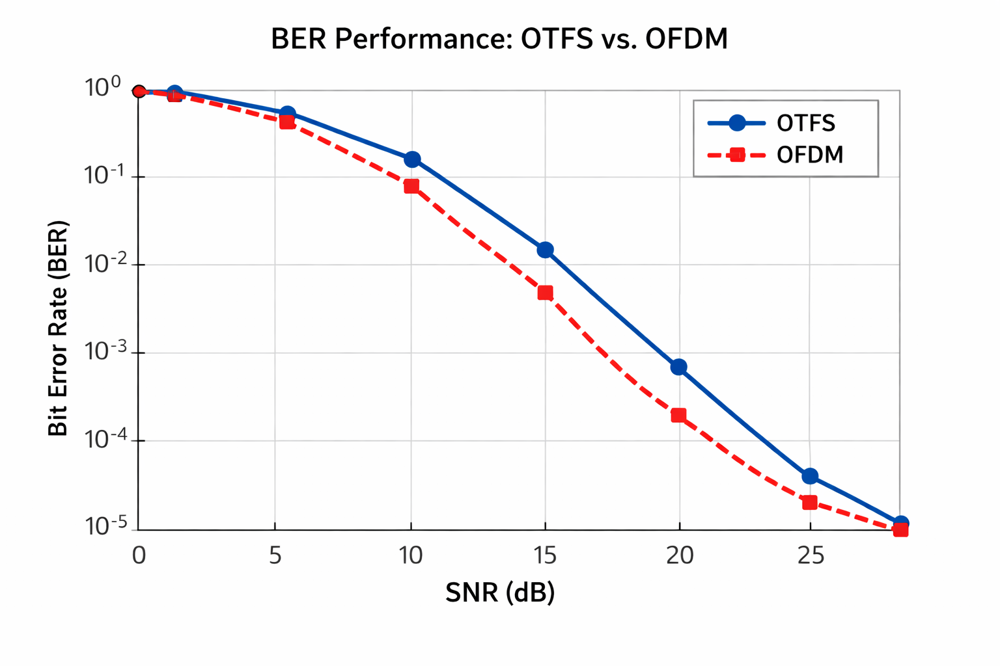

📡 OTFS 6G Simulation Project

This repository contains a MATLAB-based implementation of Orthogonal Time Frequency Space (OTFS) modulation, designed for high-mobility 6G wireless communication systems.

The project also includes OFDM for performance comparison using BER vs SNR analysis.

🚀 Overview

Orthogonal Time Frequency Space (OTFS) is a 2D modulation technique that operates in the Delay–Doppler (DD) domain, offering superior robustness against:

High Doppler spread

Time-varying multipath channels

This makes OTFS a strong waveform candidate for 6G, V2X, high-speed rail, and UAV communications.

🧱 System Architecture

OTFS Transmitter and Receiver Block Diagram

Transmitter Flow

Bits → QAM → Delay–Doppler Mapping → ISFFT → Heisenberg Transform → Channel

Receiver Flow

Channel → Wigner Transform → SFFT → Delay–Doppler Demapping → QAM Demodulation → Bits

📊 BER Performance Comparison

OTFS vs OFDM under AWGN / Time-Varying Channel

Observation:

OTFS achieves better BER performance at high SNR

OTFS is more resilient to Doppler effects than OFDM

OFDM degrades faster in high-mobility scenarios

📂 Project Structure

otfs-6g-simulation/

│

├── main\_otfs\_simulation.m     % Main simulation script

│

├── transmitter/

│   ├── otfs\_modulator.m       % OTFS modulator

│   ├── isfft.m                % Inverse SFFT

│   └── heisenberg.m           % Heisenberg transform

│

├── receiver/

│   ├── otfs\_demodulator.m     % OTFS demodulator

│   ├── wigner.m               % Wigner transform

│   └── sfft.m                 % SFFT

│

├── channel/

│   ├── awgn\_channel.m         % AWGN channel model

│   └── doubly\_selective\_channel.m

│

├── ofdm/

│   ├── ofdm\_modulator.m       % OFDM modulator

│   └── ofdm\_demodulator.m     % OFDM demodulator

│

├── analysis/

│   ├── ber\_calculation.m      % BER computation

│   └── plot\_results.m         % BER plotting

│

├── results/

│   └── (BER .mat files \& plots)

│

└── images/

&nbsp;   ├── otfs\_block\_diagram.png

&nbsp;   └── ber\_comparison.png

🧠 Theory Summary

Why OTFS?

Transmits symbols in Delay–Doppler domain

Converts time-varying channel into a nearly time-invariant representation

Improves reliability under high mobility

Key Transforms Used

ISFFT / SFFT → DD ↔ Time-Frequency conversion

Heisenberg Transform → Time-domain signal generation

Wigner Transform → Time-Frequency signal recovery

⚙️ Requirements

MATLAB R2020a or later

Communications Toolbox

▶️ How to Run

Open MATLAB

Set otfs-6g-simulation as the working directory

Run:

main\_otfs\_simulation

BER plots will be displayed

Results will be saved inside the results/ folder

📈 Output

BER vs SNR plot (OTFS \& OFDM)

.mat files storing BER results

Visual comparison of modulation performance

🎯 Applications

6G wireless systems

High-speed vehicular communication (V2X)

UAV and drone networks

High-mobility IoT scenarios

👤 Author

Sarvesh Shivasharan

Electronics \& Communication Engineering

OTFS | 6G | Wireless Systems | Signal Processing

